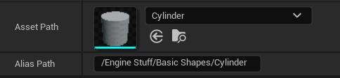

# Aliaser
Allows aliases to other assets to be shown in the Content Browser.

----------

## Usage of Aliaser

To use Aliaser, you must configure it properly within your project settings. You can find the Aliaser settings panel within `Project Settings -> Plugins -> Aliaser`.

To create an alias, add a new entry to the `Alias Entries` list. Then, select the asset you wish to alias using the `Asset Path` property. Finally, to set where the asset is aliased, type a complete content path, making sure to begin with `/`, into the `Alias Path` field. Spaces, aswell as symbols can also be used in your alias path. The following is an example of a correct asset alias.

**NOTE: Aliaser currently requires an editor restart for aliases to show in the Content Browser.**